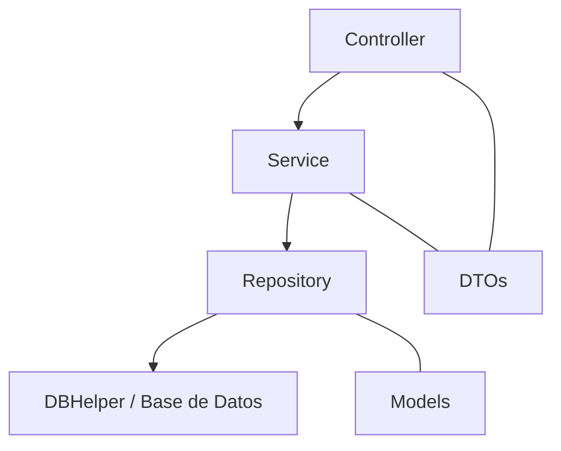

# Microservicio Reposición de PIN TC
Arquitectura base para construir microservicios en **ASP.NET Core**, siguiendo buenas prácticas de separación de capas con responsabilidades bien definidas, Inyección de Dependencias, manejo de DTOs, repositorios y respuestas genéricas. 
 
##  Características principales de la Arquitectura
 -  **Controllers**  → Exponen endpoints REST y manejan contratos de entrada/salida (DTOs).
 -  **Services**  → Contienen la lógica de negocio y validaciones.
 -  **Repositories**  → Encapsulan el acceso a datos (SQL Server).
 -  **Utils/Infrastructure**  → Clases auxiliares como `DBHelper`, `Constantes`, `GeneralResponse`. -  Uso de **DTOs**  para separar entidades internas de contratos públicos. -  Respuestas uniformes mediante `GeneralResponse`. -  Ejemplo de integración con **Stored Procedures**  en SQL Server. -  Manejo centralizado de excepciones y validaciones. --- 
 

## Estructura del proyecto

src/ 
├── Controllers/ 
│ └── Payments/PaymentsController.cs 
│ └── Products/ProductsController.cs 
├── DTOs/ 
│ └── Payments/ 
│ └── Products/ 
├── Service/ 
│ ├── Interface/ 
│ └── Implementation/ 
├── Models/ 
│ └── Pagos/ 
│ └── Productos/ 
├── Repository/ 
│ ├── Interface/ 
│ └── Implementation/ 
├── Infrastructure/ 
│ ├── Data / DBHelper.cs 
├── Utils/ 
│ ├── Constantes.cs 
│ └── GeneralResponse.cs

## Diagrama de relación de capas 
Diagrama de capas de **Arquitectura en Capas**  de la plantilla de microservicios:



##  Respuestas

1. Ejemplo de respuesta Genérica:
```json
{
  "status": 200,
  "message": "Lista de productos obtenida.",
  "data": [
    {
      "id": 1,
      "nombre": "Laptop",
      "precio": 1200.00
    }
  ]
}

## Configuración

1. Clonar el repositorio:
   ```bash
   git clone http://gitlabde.banpais.hn/procesadorregional/microservicios/plantilla_microservicios_repository.git
   
2. Configurar la cadena de conexión en `appsettings.json`:
   ```bash
	"ConnectionStrings": {
	  "DefaultConnection": "Server=localhost;Database=DB;User Id=sa;Password=Password;"
	}
# reposicion-pin
